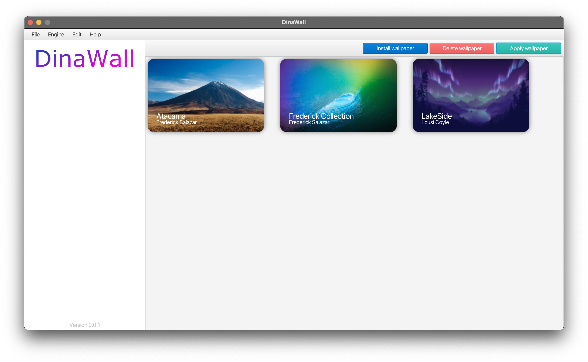
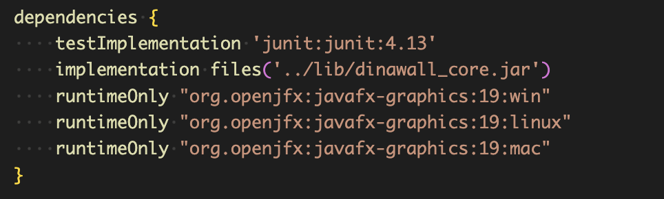

# DinaWall APP 
Dynamic Wallpaper in Linux (KDE - GNOME) Like at macOS

This JavaFX app is the Open Source cross-platform alternative to Dynamic Wallpapers created on macOS. Dynamic Wallpapers are a modern concept of wallpapers that make use of images specially configured according to the time of day to give a temporary look to the desktop.
The DinaWallpapers are the abstraction of the .heic files used in macOS and consist of an images folder and a JSON configuration file where the images are set and the time in HH:MM format in which it should be executed. Dynamic Wallpaper in Linux (KDE - GNOME) Like macOS.
In the following github repository you can find a collection of community created dynamic wallpapers that you can download to use on your PC using the DinaWall App. [Dynamic Wallpapers Official repo](https://github.com/fredericksalazar/dinamic_wallpapers_repo.git "Dynamic Wallpapers Official repo")

## Installers
This App has been written in JavaFX and does not make use of the modularity of the Java SDK. as of March 08, 2023, only .jar binaries are available for ARM platforms (Compiled on MacBook Pro M1) we are in the process of compiling on AMD - Intel architectures for distribution in the installers folder you can find the binaries for each available platform and run it using your JVM. Install

# Build Gradle

## Gradle Dependecies:
DinaWallApp has been created using the Gradle tool, the libraries required for its compilation are specified below.

* [DinaWallCore](https://github.com/fredericksalazar/dinawall_core)

### To Get or Update Dependencies Run

#### ./gradlew dependencies

## Generate new Binarie Jar to Distribution
DinaWallApp makes use of JavaFX in its version 19, this new version makes use of the modularity implemented in Java 9 but this project (DinaWallApp) does not make use of modularity, therefore the generation of the .Jar file requires compiled JavaFX libraries for each platform **javafx-graphics-19:win javafx-graphics-19:linux javafx-graphics-19:mac** and are essential to be able to generate executable .jar files for each operating system.

Remember that DinaWallApp makes use of the DinaWallCore project, before compiling or running the gradle commands you must have the dinawall_core.jar file or download the DinaWallCore project and compile it using Gradle, then you must store the generated dinawall_core.jar file in the lib folder to

Note: Generating compiled JAR files for distribution and execution on each operating system requires running this gradle command on each operating system under each architecture (X86, arm64).

./gradlew jar

